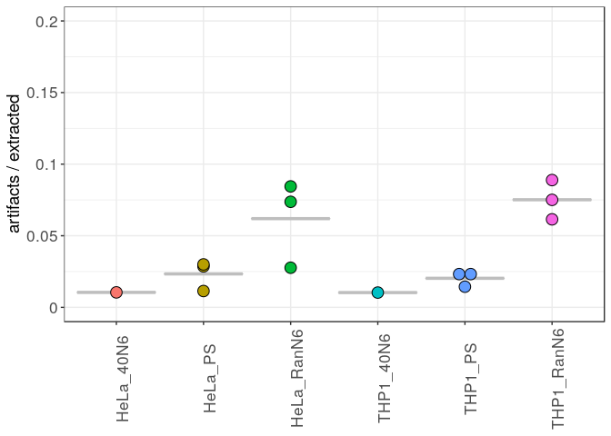
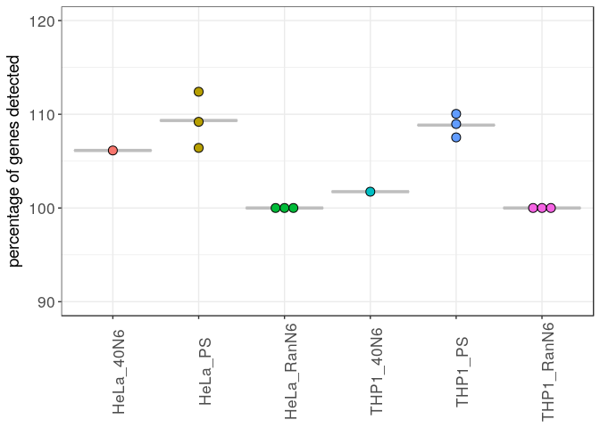
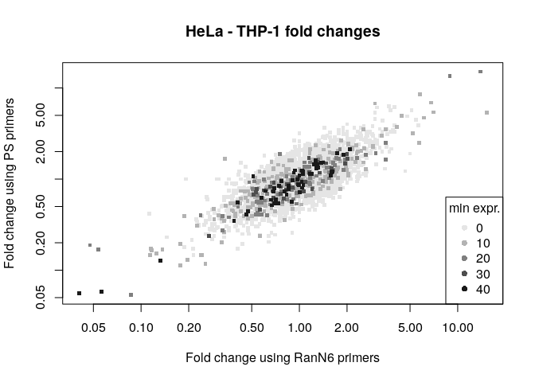

Analyze of the 3 experiments
======================================

Analysis with R
---------------
### Configuration


```r
library(oscR)        # See https://github.com/charles-plessy/oscR for oscR.
library(smallCAGEqc) # See https://github.com/charles-plessy/smallCAGEqc for smallCAGEqc.
library(vegan)
```

```
## Loading required package: permute
## Loading required package: lattice
## This is vegan 2.0-10
```

```r
library(ggplot2)
library(gdata)
```

```
## gdata: read.xls support for 'XLS' (Excel 97-2004) files ENABLED.
## 
## gdata: read.xls support for 'XLSX' (Excel 2007+) files ENABLED.
## 
## Attaching package: 'gdata'
## 
## The following object is masked from 'package:stats':
## 
##     nobs
## 
## The following object is masked from 'package:utils':
## 
##     object.size
```

```r
stopifnot(
    packageVersion("oscR") >= "0.1.1"
  , packageVersion("smallCAGEqc") > "0.10.0"
)
```

### Load the data


```r
libs_NC12 <- read.table("../Nc12_clean/libs_NC12_1.txt", sep="\t", head=T)
libs_NCki <- read.table("../NCki_clean/libs_NCki_1.txt", sep="\t", head=T)
libs_NC17 <- read.table("../NC17_clean/libs_NC17_1.txt", sep="\t", head=T)
```

### Merge 3 tables

The data coming from the 3 experiments are merged in one table to analyzed them together


```r
rownames(libs_NC12) <- sub('NC12.', 'NC12_', rownames(libs_NC12)) 
```


```r
libs <- rbind(libs_NC12, libs_NC17, libs_NCki)
```

#### Add the celltype


```r
libs$celltype <- libs$samplename
libs$celltype <- sub('NC.._', '', libs$celltype)
libs$celltype <- sub('_.*', '', libs$celltype)
libs$celltype <- factor(libs$celltype)
```

### Figure S2
Modification of the table libs (group by triplicates)


```r
libs2 <- libs
libs2$group <-libs2$samplename
libs2$group <- sub('_.$', '', libs2$group)
libs2$group <- factor(libs2$group)
```


```r
plotAnnot(libs2, 'all', 'pseudo-random primers') + theme_bw()
```

```
## Using group as id variables
## Using group as id variables
```

```
## Warning: Stacking not well defined when ymin != 0
```

 


```r
libs <- libs[grep('_RanN6|_PS|_40N6', libs$samplename, value=T),]
libs <- drop.levels(libs)

write.table(libs, "libs.txt", sep="\t", quote=F)
```


### Impact rDNA and artefacts

Calculate means by triplicate


```r
libm <- with (libs
, data.frame(samplename, group, celltype
, promoter = promoter / extracted
, exon = exon / extracted
, intron = intron/extracted
, unknown = unknown / extracted
, rDNA = rdna / extracted
, artefacts = tagdust / extracted
))
libm$triplicates <- sub('_.$', '', libm$samplename)
libm <- aggregate(libm[,c('rDNA','artefacts')], list(libm$triplicates), mean)
libm$artefact1000 <- (libm$artefacts)*1000
libm$rDNA1000 <- (libm$rDNA)*1000
libm$group <- libm$Group.1
libm$group <- sub('NC.._', '',libm$group)
```

Draw graph


```r
dotsize <- mean(libm$artefact1000) /5
p <- ggplot(libm, aes(y=artefact1000, x=group)) +
stat_summary(fun.y=mean, fun.ymin=mean, fun.ymax=mean, 
geom="crossbar", color="gray") +
       geom_dotplot(aes(fill=group), binaxis='y', binwidth=1, 
dotsize=dotsize, stackdir='center') +
       	theme_bw() +
	theme(axis.text.x = element_text(size=13, angle=90)) +
	theme(axis.text.y = element_text(size=13)) +
	theme(axis.title.x = element_blank())+
	theme(axis.title.y = element_text(size=14))+
	scale_y_continuous(breaks =c(0, 50, 100, 150, 200), limits= c(0,200), labels=c("0", "0.05", "0.1", "0.15", "0.2")) +
     ylab("artifacts / extracted")
p + theme(legend.position="none")
```

 


```r
dotsize <- mean(libm$rDNA1000)/10
p <- ggplot(libm, aes(y=rDNA1000, x=group)) +
stat_summary(fun.y=mean, fun.ymin=mean, fun.ymax=mean, 
geom="crossbar", color="gray") +
       geom_dotplot(aes(fill=group), binaxis='y', binwidth=1, 
dotsize=dotsize, stackdir='center') +
       	theme_bw() +
	theme(axis.text.x = element_text(size=13, angle=90)) +
	theme(axis.text.y = element_text(size=13)) +
	theme(axis.title.x = element_blank())+
	theme(axis.title.y = element_text(size=14))+
	scale_y_continuous(limits=c(0,900), breaks =c(0, 200, 400, 600, 800), labels=c("0", "0.2", "0.4", "0.6", "0.8")) +
     ylab("rRNA / extracted")
p + theme(legend.position="none")
```

 

### Numbers of genes: percentage


```r
genes_percentage <- libs[,c('samplename', 'group', 'genes.sub1')]
genes_percentage$group1 <- genes_percentage$samplename
genes_percentage$group1 <- sub('_.$', '', genes_percentage$group1)
genes_percentage$group1 <- factor(genes_percentage$group1)
genes_percentage <- tapply(genes_percentage$genes.sub1, genes_percentage$group1, mean)

genes_percentage <- sapply(
  c("NC12_HeLa", "NC12_THP1", "NC17_HeLa", "NC17_THP1", "NCki_HeLa", "NCki_THP1"),
  function(experiment) genes_percentage[grep(experiment, names(genes_percentage))] / genes_percentage[paste0(experiment, "_RanN6")] * 100
)
genes_percentage <- unlist(genes_percentage)
names(genes_percentage) <- sub(".*\\.", "", names(genes_percentage))
```


```r
genes_percentage <- data.frame(genes_percentage)
genes_percentage$group <- rownames(genes_percentage)
genes_percentage$group <- sub('NC.._', '', genes_percentage$group)
```


```r
dotsize <- mean(genes_percentage$genes_percentage)/110
p <- ggplot(genes_percentage, aes(x=group, y=genes_percentage)) +
stat_summary(fun.y=mean, fun.ymin=mean, fun.ymax=mean, 
geom="crossbar", color="gray") +
       geom_dotplot(aes(fill=group), binaxis='y', binwidth=1, 
dotsize=dotsize, stackdir='center') +
         theme_bw() +
	theme(axis.text.x = element_text(size=13, angle=90)) +
	theme(axis.text.y = element_text(size=13)) +
	theme(axis.title.x = element_blank())+
	theme(axis.title.y = element_text(size=14))+
	scale_y_continuous(limits=c(90,120)) +
     ylab("percentage of genes detected")
p + theme(legend.position="none")
```

 


Transcriptome analysis
-------------
Load the data


```r
g2_NC12 <- read.table('../Nc12_clean/g2.sub1_NC12_1.txt', sep="\t", head=T)
g2_NC17 <- read.table('../NC17_clean/g2.sub1_NC17_1.txt', sep="\t", head=T)
g2_NCki <- read.table('../NCki_clean/g2.sub1_NCki_1.txt', sep="\t", head=T)
```

Create a new table

```r
g2 <- merge(g2_NC12, g2_NC17, by='row.names', all=T)

rownames(g2) <- g2$Row.names
g2 <- g2[,-1]
g2 <- merge(g2,g2_NCki, by='row.names', all=T)

rownames(g2) <- g2$Row.names
g2 <- g2[,-1]

g2[is.na(g2)] <- 0

g2b <- g2[-1,]
```


```r
RanN6_HeLa = c('NC12.HeLa_RanN6_A', 'NC12.HeLa_RanN6_B', 'NC12.HeLa_RanN6_C'
 , 'NC17_HeLa_RanN6_A', 'NC17_HeLa_RanN6_B', 'NC17_HeLa_RanN6_C'
   , 'NCki_HeLa_RanN6_A',   'NCki_HeLa_RanN6_B',   'NCki_HeLa_RanN6_C')

PS_HeLa = c( 'NC12.HeLa_PS_A',  'NC12.HeLa_PS_B',  'NC12.HeLa_PS_C'
  , 'NC17_HeLa_PS_A',   'NC17_HeLa_PS_B',   'NC17_HeLa_PS_C'
 , 'NCki_HeLa_PS_A',  'NCki_HeLa_PS_B',  'NCki_HeLa_PS_C')

RanN6_THP1 = c( 'NC12.THP1_RanN6_A', 'NC12.THP1_RanN6_B', 'NC12.THP1_RanN6_C'
 , 'NC17_THP1_RanN6_A', 'NC17_THP1_RanN6_B', 'NC17_THP1_RanN6_C'
 , 'NCki_THP1_RanN6_A',   'NCki_THP1_RanN6_B',   'NCki_THP1_RanN6_C')

PS_THP1 = c( 'NC12.THP1_PS_A', 'NC12.THP1_PS_B', 'NC12.THP1_PS_C'
 , 'NC17_THP1_PS_A',  'NC17_THP1_PS_B',  'NC17_THP1_PS_C'
 , 'NCki_THP1_PS_A', 'NCki_THP1_PS_B', 'NCki_THP1_PS_C')
```


```r
mx <- function(DATA)
 {data.frame( HeLa_RanN6 = rowMeans(DATA[,RanN6_HeLa])
            , HeLa_pseudoRan = rowMeans(DATA[,PS_HeLa])
            , THP1_RanN6     = rowMeans(DATA[,RanN6_THP1])
            , THP1_pseudoRan = rowMeans(DATA[,PS_THP1]))}

m2 <- mx(g2)

write.table(m2, "m2.txt", sep = "\t", quote = FALSE)
```


```r
panel.cor <- function(x, y, digits=2, prefix="", cex.cor, ...)
     {
         usr <- par("usr"); on.exit(par(usr))
         par(usr = c(0, 1, 0, 1))
         r <- abs(cor(x, y))
         txt <- format(c(r, 0.123456789), digits=digits)[1]
         txt <- paste(prefix, txt, sep="")
         if(missing(cex.cor)) cex.cor <- 0.8/strwidth(txt)
         text(0.5, 0.5, txt, cex = cex.cor * r)
     }

pointsUnique <- function(x,y,...)
  points(unique(data.frame(x,y)),...)

pairPanel <- function(dataframe, title)
  pairs( dataframe
       , lower.panel=panel.cor
       , upper.panel=pointsUnique
       , main=title
       , pch='.', cex=4)
```


```r
pairPanel(log(m2+1), 'pseudo-random primers')
```

 


```r
plotFoldChange <- function (DATA, COL, MAX, FUN=points, ...) {
 with( DATA[rowSums(DATA) > MAX,] +1
     , FUN( HeLa_RanN6     / THP1_RanN6
          , HeLa_pseudoRan / THP1_pseudoRan
          , col=COL
          , pch='.'
          , cex=5
          , ... ))
}
```


```r
plotFoldChangeGrays <- function (DATA, TITLE, xlab="Fold change using RanN6 primers", ylab="Fold change using PS primers"  ) {
  plotFoldChange( DATA,'gray90', 0
                , plot, log='xy', main=TITLE
                , xlab=xlab, ylab=ylab)
  plotFoldChange(DATA, 'gray70', 10)
  plotFoldChange(DATA, 'gray50', 20)
  plotFoldChange(DATA, 'gray30', 30)
  plotFoldChange(DATA, 'gray10', 40)
  legend( 'bottomright'
        , legend=c(0, 10, 20, 30, 40)
        , col=c('gray90', 'gray70', 'gray50', 'gray30', 'gray10')
        , pch=16, title='min expr.')
}
```


```r
u2 <- unique(m2)
```
Draw graphs


```r
plotFoldChangeGrays(u2, "HeLa - THP-1 fold changes")
```

 


```r
plotFoldChange( u2, 'gray10', 0
              , plot, log='xy', main="HeLa - THP-1 fold changes"
              , xlab="Standard N6 random primers", ylab="Pseudo-random primers")
```

 
