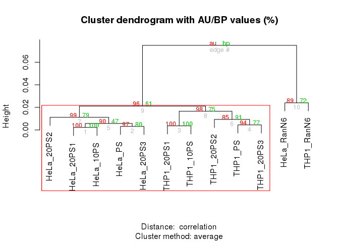

Analyze of the third experiment: NC17
======================================

Cluster and annotate in the shell (not in R)
--------------------------------------------


```bash
LIBRARY=NC16-17_1
BAMFILES=../Moirai/NC16-17_1.CAGEscan_short-reads.20150625154740/properly_paired_rmdup/*bam

level1.py -o $LIBRARY.l1.gz -f 66 -F 516 $BAMFILES
level2.py -t 0 -o $LIBRARY.l2.gz $LIBRARY.l1.gz

function osc2bed {
  zcat $1 |
    grep -v \# |
    sed 1d |
    awk '{OFS="\t"}{print $2, $3, $4, "l1", "1000", $5}'
}

function bed2annot {
  bedtools intersect -a $1 -b ../annotation/annot.bed -s -loj |
    awk '{OFS="\t"}{print $1":"$2"-"$3$6,$10}' | 
    bedtools groupby -g 1 -c 2 -o collapse
}

function bed2symbols {
  bedtools intersect -a $1 -b ../annotation/gencode.v14.annotation.genes.bed -s -loj |
    awk '{OFS="\t"}{print $1":"$2"-"$3$6,$10}' | 
    bedtools groupby -g 1 -c 2 -o distinct
}

osc2bed $LIBRARY.l2.gz | tee $LIBRARY.l2.bed | bed2annot - > $LIBRARY.l2.annot
bed2symbols $LIBRARY.l2.bed > $LIBRARY.l2.genes
```

```
## Opening NC16-17_1.l1.gz
```

Analysis with R
---------------


```r
library(oscR)        #  See https://github.com/charles-plessy/oscR for oscR.
library(smallCAGEqc) # See https://github.com/charles-plessy/smallCAGEqc for smallCAGEqc.
library(vegan)
```

```
## Loading required package: permute
## Loading required package: lattice
## This is vegan 2.0-10
```

```r
library(ggplot2)
library(pvclust)

stopifnot(
    packageVersion("oscR") >= "0.1.1"
  , packageVersion("smallCAGEqc") > "0.10.0"
)

LIBRARY <- "NC16-17_1"
```

### Load data


```r
l2_NC17 <- read.osc(paste(LIBRARY,'l2','gz',sep='.'), drop.coord=T, drop.norm=T)
colnames(l2_NC17) <- sub('raw.NC16.17_1.17', 'NC17', colnames(l2_NC17))
colSums(l2_NC17)
```

```
##  NC17_HeLa_10PS_A  NC17_HeLa_10PS_B  NC17_HeLa_10PS_C NC17_HeLa_20PS1_A NC17_HeLa_20PS1_B NC17_HeLa_20PS1_C 
##             31006             29327             34781             29549             18858             18469 
## NC17_HeLa_20PS2_A NC17_HeLa_20PS2_B NC17_HeLa_20PS2_C NC17_HeLa_20PS3_A NC17_HeLa_20PS3_B NC17_HeLa_20PS3_C 
##             23579             15882             18592             26289             15389             15712 
##    NC17_HeLa_PS_A    NC17_HeLa_PS_B    NC17_HeLa_PS_C NC17_HeLa_RanN6_A NC17_HeLa_RanN6_B NC17_HeLa_RanN6_C 
##             29038             21308             29123             44255             17650             21824 
##  NC17_THP1_10PS_A  NC17_THP1_10PS_B  NC17_THP1_10PS_C NC17_THP1_20PS1_A NC17_THP1_20PS1_B NC17_THP1_20PS1_C 
##             26158             19394             28814             17733             14452             19870 
## NC17_THP1_20PS2_A NC17_THP1_20PS2_B NC17_THP1_20PS2_C NC17_THP1_20PS3_A NC17_THP1_20PS3_B NC17_THP1_20PS3_C 
##             19562             11486             21205             23229             21447             17429 
##    NC17_THP1_PS_A    NC17_THP1_PS_B    NC17_THP1_PS_C NC17_THP1_RanN6_A NC17_THP1_RanN6_B NC17_THP1_RanN6_C 
##             24370             18173             20788             20236             14661             22048
```

### Normalization number of read per sample: l2.sub ; libs$genes.sub
In all the 3 libraries used, one contain only few reads tags. The smallest one has 8,708 counts. In order to make meaningful comparisons, all of them are subsapled to 8700 counts.


```r
set.seed(1)
l2.sub1 <- t(rrarefy(t(l2_NC17),min(8700)))
colSums(l2.sub1)
```

```
##  NC17_HeLa_10PS_A  NC17_HeLa_10PS_B  NC17_HeLa_10PS_C NC17_HeLa_20PS1_A NC17_HeLa_20PS1_B NC17_HeLa_20PS1_C 
##              8700              8700              8700              8700              8700              8700 
## NC17_HeLa_20PS2_A NC17_HeLa_20PS2_B NC17_HeLa_20PS2_C NC17_HeLa_20PS3_A NC17_HeLa_20PS3_B NC17_HeLa_20PS3_C 
##              8700              8700              8700              8700              8700              8700 
##    NC17_HeLa_PS_A    NC17_HeLa_PS_B    NC17_HeLa_PS_C NC17_HeLa_RanN6_A NC17_HeLa_RanN6_B NC17_HeLa_RanN6_C 
##              8700              8700              8700              8700              8700              8700 
##  NC17_THP1_10PS_A  NC17_THP1_10PS_B  NC17_THP1_10PS_C NC17_THP1_20PS1_A NC17_THP1_20PS1_B NC17_THP1_20PS1_C 
##              8700              8700              8700              8700              8700              8700 
## NC17_THP1_20PS2_A NC17_THP1_20PS2_B NC17_THP1_20PS2_C NC17_THP1_20PS3_A NC17_THP1_20PS3_B NC17_THP1_20PS3_C 
##              8700              8700              8700              8700              8700              8700 
##    NC17_THP1_PS_A    NC17_THP1_PS_B    NC17_THP1_PS_C NC17_THP1_RanN6_A NC17_THP1_RanN6_B NC17_THP1_RanN6_C 
##              8700              8700              8700              8700              8700              8700
```

### Moirai statistics

Load the QC data produced by the Moirai workflow with which the libraries were processed. Sort in the same way as the l1 and l2 tables, to allow for easy addition of columns.


```r
libs <- loadMoiraiStats(multiplex = "NC16-17_1.multiplex.txt", summary = "../Moirai/NC16-17_1.CAGEscan_short-reads.20150625154740/text/summary.txt", pipeline = "CAGEscan_short-reads")
```

### Number of clusters

Count the number of unique L2 clusters per libraries after subsampling, and add
this to the QC table.  Each subsampling will give a different result, but the
mean result can be calculated by using the `rarefy` function at the same scale
as the subsampling.


```r
libs["l2.sub1"]     <- colSums(l2.sub1 > 0)
libs["l2.sub1.exp"] <- rarefy(t(l2_NC17), min(colSums(l2_NC17)))
```

### Richness

Richness should also be calculated on the whole data.


```r
libs["r100.l2"] <- rarefy(t(l2_NC17),100)
```


```r
boxplot(data=libs, r100.l2 ~ group, ylim=c(80,100), las=1)
```

 

### Hierarchical annotation

Differences of sampling will not bias distort the distribution of reads between annotations, so the non-subsampled library is used here.


```r
annot.l2 <- read.table(paste(LIBRARY,'l2','annot',sep='.'), head=F, col.names=c('id', 'feature'), row.names=1)
annot.l2 <- hierarchAnnot(annot.l2)

rownames(libs) <- sub("17_", "NC17_", rownames(libs))

libs <- cbind(libs, t(rowsum(l2_NC17,  annot.l2[,'class']))) 
libs$samplename <- sub('17_', 'NC17_', libs$samplename)
```

### Gene symbols used normalisation data


```r
genesymbols <- read.table(paste(LIBRARY,'l2','genes',sep='.'), col.names=c("cluster","symbol"), stringsAsFactors=FALSE)
rownames(genesymbols) <- genesymbols$cluster

g2 <- rowsum(l2_NC17, genesymbols$symbol)
countSymbols <- countSymbols(g2)

libs[colnames(l2_NC17),"genes"] <- (countSymbols)
```

Number of genes detected in sub-sample


```r
l2.sub1 <- data.frame(l2.sub1)
g2.sub1 <- rowsum(l2.sub1, genesymbols$symbol)
countSymbols.sub1 <- countSymbols(g2.sub1)
libs[colnames(l2.sub1),"genes.sub1"] <- (countSymbols.sub1)
```

### Comparison trancriptome


```r
m2 <- data.frame(
  HeLa_RanN6  = rowMeans(g2[, c('NC17_HeLa_RanN6_A',   'NC17_HeLa_RanN6_B',   'NC17_HeLa_RanN6_C')]),
  HeLa_PS = rowMeans(g2[, c('NC17_HeLa_PS_A', 'NC17_HeLa_PS_B', 'NC17_HeLa_PS_C')]),
  HeLa_20PS3 = rowMeans(g2[, c('NC17_HeLa_20PS3_A', 'NC17_HeLa_20PS3_B', 'NC17_HeLa_20PS3_C')]),
  HeLa_20PS1 = rowMeans(g2[, c('NC17_HeLa_20PS1_A', 'NC17_HeLa_20PS1_B', 'NC17_HeLa_20PS1_C')]),
  HeLa_20PS2 = rowMeans(g2[, c('NC17_HeLa_20PS2_A', 'NC17_HeLa_20PS2_B', 'NC17_HeLa_20PS2_C')]),
  HeLa_10PS = rowMeans(g2[, c('NC17_HeLa_10PS_A', 'NC17_HeLa_10PS_B', 'NC17_HeLa_10PS_C')]),
  THP1_RanN6  = rowMeans(g2[, c('NC17_THP1_RanN6_A',   'NC17_THP1_RanN6_B',   'NC17_THP1_RanN6_C')]),
  THP1_PS = rowMeans(g2[, c('NC17_THP1_PS_A', 'NC17_THP1_PS_B', 'NC17_THP1_PS_C')]),
  THP1_20PS3 = rowMeans(g2[, c('NC17_THP1_20PS3_A', 'NC17_THP1_20PS3_B', 'NC17_THP1_20PS3_C')]),
  THP1_20PS1 = rowMeans(g2[, c('NC17_THP1_20PS1_A', 'NC17_THP1_20PS1_B', 'NC17_THP1_20PS1_C')]),
  THP1_20PS2 = rowMeans(g2[, c('NC17_THP1_20PS2_A', 'NC17_THP1_20PS2_B', 'NC17_THP1_20PS2_C')]),
  THP1_10PS = rowMeans(g2[, c('NC17_THP1_10PS_A', 'NC17_THP1_10PS_B', 'NC17_THP1_10PS_C')])
)
```


```r
results <- pvclust(m2)
```

```
## Bootstrap (r = 0.5)... Done.
## Bootstrap (r = 0.6)... Done.
## Bootstrap (r = 0.7)... Done.
## Bootstrap (r = 0.8)... Done.
## Bootstrap (r = 0.9)... Done.
## Bootstrap (r = 1.0)... Done.
## Bootstrap (r = 1.1)... Done.
## Bootstrap (r = 1.2)... Done.
## Bootstrap (r = 1.3)... Done.
## Bootstrap (r = 1.4)... Done.
```

```r
plot(results)
pvrect(results, alpha=0.95)
```

 

### Table record

save the different tables produced for later analysis


```r
write.table(l2_NC17, "l2_NC17_1.txt", sep = "\t", quote=FALSE)
write.table(l2.sub1, "l2.sub1_NC17_1.txt", sep = "\t", quote=FALSE)
write.table(g2.sub1, 'g2.sub1_NC17_1.txt', sep="\t", quote=F)
write.table(libs, 'libs_NC17_1.txt', sep="\t", quote=F)
write.table(m2, "m2_NC17_1.txt", sep = "\t", quote = FALSE)
```
