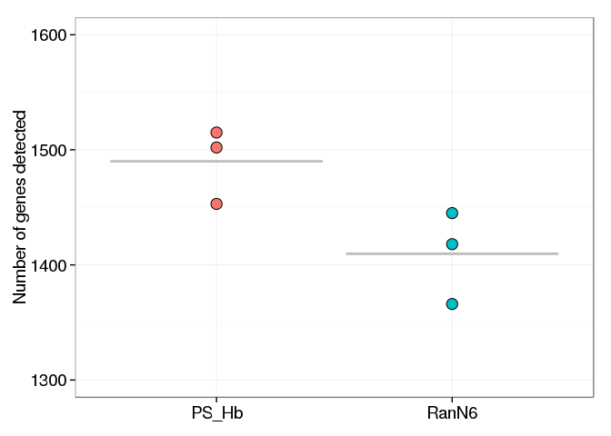
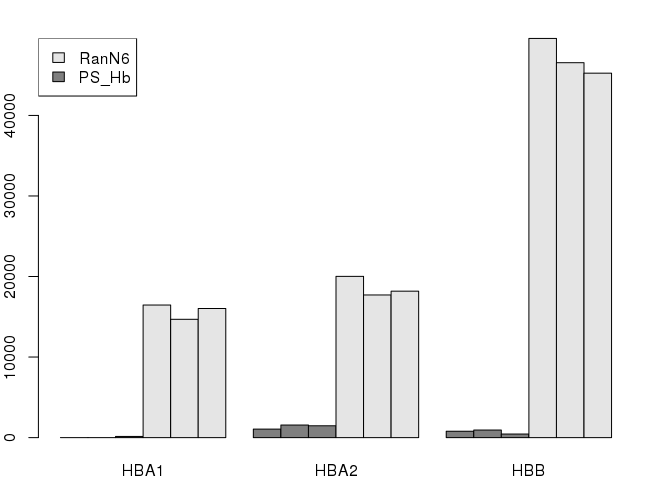

Targeted reduction of Hemoglobin cDNAs
======================================

Configuration
-------------


Cluster and annotate in the shell (not in R)
--------------------------------------------


```bash
LIBRARY=NC22b
BAMFILES=../Moirai/NC22b.CAGEscan_short-reads.20150625152335/properly_paired_rmdup/*bam

level1.py -o /dev/stdout -f 66 -F 516 $BAMFILES |
  bgzip > $LIBRARY.l1.gz
cat <(zgrep \# -A1 $LIBRARY.l1.gz) <(zgrep -v \# $LIBRARY.l1.gz | sed '1d' |
  sort --field-separator $'\t' -k2.4,2n -k 2.4,2.4 -k3,3n -k4,4n -k5,5) |
  bgzip |
  sponge $LIBRARY.l1.gz
level2.py -t 0 -o $LIBRARY.l2.gz $LIBRARY.l1.gz

function osc2bed {
  zcat $1 |
    grep -v \# |
    sed 1d |
    awk '{OFS="\t"}{print $2, $3, $4, "l1", "1000", $5}'
}

function bed2annot {
  bedtools intersect -a $1 -b ../annotation/annot.bed -s -loj |
    awk '{OFS="\t"}{print $1":"$2"-"$3$6,$10}' | 
    bedtools groupby -g 1 -c 2 -o collapse
}

function bed2symbols {
  bedtools intersect -a $1 -b ../annotation/gencode.v14.annotation.genes.bed -s -loj |
    awk '{OFS="\t"}{print $1":"$2"-"$3$6,$10}' | 
    bedtools groupby -g 1 -c 2 -o distinct
}

osc2bed $LIBRARY.l2.gz | tee $LIBRARY.l2.bed | bed2annot - > $LIBRARY.l2.annot
bed2symbols $LIBRARY.l2.bed > $LIBRARY.l2.genes
```

```
## Opening NC22b.l1.gz
```

Analysis with R
---------------

### Configuration


```r
library(oscR)        #  See https://github.com/charles-plessy/oscR for oscR.
library(smallCAGEqc) # See https://github.com/charles-plessy/smallCAGEqc for smallCAGEqc.
library(vegan)
```

```
## Loading required package: permute
## Loading required package: lattice
## This is vegan 2.0-10
```

```r
library(ggplot2)
library(pvclust)

stopifnot(
    packageVersion("oscR") >= "0.1.1"
  , packageVersion("smallCAGEqc") > "0.10.0"
)

LIBRARY <- "NC22b"
```

### Load data


```r
l1 <- read.osc(paste(LIBRARY,'l1','gz',sep='.'), drop.coord=T, drop.norm=T)
l2 <- read.osc(paste(LIBRARY,'l2','gz',sep='.'), drop.coord=T, drop.norm=T)

colnames(l1) <- sub('raw.NC22b.','',colnames(l1))
colnames(l2) <- sub('raw.NC22b.','',colnames(l2))

colSums(l2)
```

```
##  22_PSHb_A  22_PSHb_B  22_PSHb_C 22_RanN6_A 22_RanN6_B 22_RanN6_C 
##       3786       3196       6805      17433      18864      17218
```

```r
PSHb <- c('22_PSHb_A', '22_PSHb_B', '22_PSHb_C')
RanN6    <- c('22_RanN6_A', '22_RanN6_B', '22_RanN6_C')
```

### Normalization number of read per sample : libs2.sub

Libraries contain only very few reads tags. The smallest one has 3,191 counts.
In order to make meaningful comparisons, all of them are subsapled to 3190 counts.


```r
set.seed(1)
l2.sub <- t(rrarefy(t(l2),3190))
colSums(l2.sub)
```

```
##  22_PSHb_A  22_PSHb_B  22_PSHb_C 22_RanN6_A 22_RanN6_B 22_RanN6_C 
##       3190       3190       3190       3190       3190       3190
```

### Moirai statistics

Load the QC data produced by the Moirai workflow with which the libraries were
processed.  Sort in the same way as the `l1` and `l2` tables, to allow for easy
addition of columns. 


```r
libs <- loadMoiraiStats(multiplex = "NC22b.multiplex.txt", summary = "../Moirai/NC22b.CAGEscan_short-reads.20150625152335/text/summary.txt", pipeline = "CAGEscan_short-reads")
libs <- libs[colnames(l1),]
```

### Number of clusters

Count the number of unique L2 clusters per libraries after subsampling, and add
this to the QC table.  Each subsampling will give a different result, but the
mean result can be calculated by using the `rarefy` function at the same scale
as the subsampling.


```r
libs["l2.sub"]     <- colSums(l2.sub > 0)
libs["l2.sub.exp"] <- rarefy(t(l2), min(colSums(l2)))
```

### Richness

Richness should also be calculated on the whole data.


```r
libs["r100.l2"] <- rarefy(t(l2),100)
t.test(data=libs, r100.l2 ~ group)
```

```
## 
## 	Welch Two Sample t-test
## 
## data:  r100.l2 by group
## t = 6.9316, df = 3.2275, p-value = 0.00484
## alternative hypothesis: true difference in means is not equal to 0
## 95 percent confidence interval:
##  3.138322 8.096966
## sample estimates:
## mean in group PS_Hb mean in group RanN6 
##            94.37637            88.75873
```


```r
boxplot(data=libs, r100.l2 ~ group, ylim=c(80,100), las=1)
```

 

### Hierarchical annotation

Differences of sampling will not bias distort the distribution of reads between
annotations, so the non-subsampled library is used here.


```r
annot.l2 <- read.table(paste(LIBRARY,'l2','annot',sep='.'), head=F, col.names=c('id', 'feature'), row.names=1)
annot.l2 <- hierarchAnnot(annot.l2)

libs <- cbind(libs, t(rowsum(l2,  annot.l2[,'class']))) 
```

### Gene symbols used normalisation data


```r
genesymbols <- read.table(paste(LIBRARY,'l2','genes',sep='.'), col.names=c("cluster","symbol"), stringsAsFactors=FALSE)
rownames(genesymbols) <- genesymbols$cluster

countSymbols <- function(X) length(unique(genesymbols[X > 0,'symbol']))

libs[colnames(l2.sub),"genes.sub"] <- apply(l2.sub, 2, countSymbols)
libs[colnames(l2),        "genes"] <- apply(l2,     2, countSymbols)
```


```r
dotsize <- mean(libs$genes.sub) /150
par(mar=c(7,10,2,30))
p <- ggplot(libs, aes(x=group, y=genes.sub)) +
stat_summary(fun.y=mean, fun.ymin=mean, fun.ymax=mean, 
geom="crossbar", color="gray") +
       geom_dotplot(aes(fill=group), binaxis='y', binwidth=1, 
dotsize=dotsize, stackdir='center') +
       	theme_bw() +
	theme(axis.text.x = element_text(size=14)) +
	theme(axis.text.y = element_text(size=14)) +
	theme(axis.title.x = element_blank())+
	theme(axis.title.y = element_text(size=14))+
  ylim(1300,1600) +
	ylab("Number of genes detected")
p + theme(legend.position="none")
```

 

#### statistical analysis of gene count (with normalized data)


```r
t.test(data=libs, genes.sub ~ group)
```

```
## 
## 	Welch Two Sample t-test
## 
## data:  genes.sub by group
## t = 2.6871, df = 3.8422, p-value = 0.05721
## alternative hypothesis: true difference in means is not equal to 0
## 95 percent confidence interval:
##   -4.033183 164.699850
## sample estimates:
## mean in group PS_Hb mean in group RanN6 
##            1490.000            1409.667
```


### Analysis of the gene expressed in different sample with different primers - normalized data (l2.sub)


```r
l2_to_g2 <- function(l2) {
  g2 <- rowsum(l2, genesymbols$symbol)
  as.data.frame(subset(g2, rowSums(g2) > 0))
}

g2.sub <- l2_to_g2(l2.sub)
g2     <- l2_to_g2(l2)  
G2 <- TPM(g2)

libs$genes.r <- rarefy(t(g2), 3190)[rownames(libs)]

t.test(data=libs, genes.r ~ group)
```

```
## 
## 	Welch Two Sample t-test
## 
## data:  genes.r by group
## t = 2.9155, df = 3.5384, p-value = 0.05045
## alternative hypothesis: true difference in means is not equal to 0
## 95 percent confidence interval:
##   -0.2644882 157.0951552
## sample estimates:
## mean in group PS_Hb mean in group RanN6 
##            1493.233            1414.817
```


```r
G2mean <- function(TABLE)
  TPM(data.frame( RanN6    = rowSums(TABLE[,RanN6])
                , PS_Hb    = rowSums(TABLE[,PSHb] )))

G2.sub.mean <- G2mean(g2.sub)
G2.mean     <- G2mean(g2)
```


```r
head(G2.sub.mean[order(G2.sub.mean$RanN6, decreasing=TRUE),], 30)
```

```
##                            RanN6       PS_Hb
## .                     108568.443 111076.2800
## J01415.4               86624.869  18390.8046
## HBB                    51619.645    835.9457
## HBA2                   18913.271   1149.4253
## MALAT1                 18704.284  44723.0930
## J01415.2,J01415.24     17450.366   3552.7691
## J01415.24              17032.393   4806.6876
## HBA1                   16300.940      0.0000
## Metazoa_SRP            12539.185   1253.9185
## RN7SL2                  9717.868   6792.0585
## J01415.3,J01415.4       8986.416   2194.3574
## B2M                     8150.470   4493.2079
## Metazoa_SRP,RN7SL1      7941.484   1671.8913
## MT-ND6                  5015.674   8777.4295
## ACTB                    4806.688    731.4525
## BNIP3L                  3761.755  10240.3344
## FTL                     3448.276   1462.9049
## DHFR                    2298.851   1044.9321
## MT-ND4                  2194.357      0.0000
## UBB                     2194.357   2298.8506
## RN7SK                   1985.371   1567.3981
## RNY4                    1985.371    104.4932
## RPS6                    1776.385   2612.3302
## S100A11                 1776.385      0.0000
## ALAS2                   1671.891    626.9592
## MTRNR2L8                1671.891    104.4932
## RP11-1035H13.3,RPS15A   1671.891    208.9864
## SAT1                    1671.891   2821.3166
## TMSB4X                  1671.891    417.9728
## CCL5                    1567.398    104.4932
```


```r
head(G2.sub.mean[order(G2.sub.mean$PS_Hb, decreasing=TRUE),], 30)
```

```
##                          RanN6      PS_Hb
## .                  108568.4431 111076.280
## MALAT1              18704.2842  44723.093
## J01415.4            86624.8694  18390.805
## BNIP3L               3761.7555  10240.334
## BCL2L1                522.4660   9404.389
## MT-ND6               5015.6740   8777.429
## HEMGN                 835.9457   7836.991
## HNRNPK                626.9592   7419.018
## RN7SL2               9717.8683   6792.059
## J01415.24           17032.3929   4806.688
## RPL5                  940.4389   4702.194
## B2M                  8150.4702   4493.208
## COX7C                 104.4932   4388.715
## J01415.2,J01415.24  17450.3657   3552.769
## LCP2                  626.9592   3552.769
## NCOA4,TIMM23B         626.9592   3552.769
## RNU2-2,WDR74          313.4796   3552.769
## TPM3                  940.4389   3552.769
## C9orf78               522.4660   3343.783
## PKM                   313.4796   3343.783
## SNHG12,SNORD99       1358.4117   3239.289
## PTMA                  208.9864   3030.303
## GYPC                  940.4389   2925.810
## SAT1                 1671.8913   2821.317
## ARPC3                 417.9728   2716.823
## SON                   835.9457   2716.823
## UQCRB                 104.4932   2716.823
## DCUN1D1               104.4932   2612.330
## HMGB1                 731.4525   2612.330
## RPS6                 1776.3845   2612.330
```

### Gene list on normalized data (table l2.sub)

```r
RanN6_genelist.sub <- listSymbols(rownames(subset(G2.sub.mean, RanN6>0)))
PSHb_genelist.sub <- listSymbols(rownames(subset(G2.sub.mean, PS_Hb>0)))
```


```r
genelist <- listSymbols(rownames(g2))
```


```r
write.table(genelist, 'NC22.genelist.txt', sep = "\t", quote = FALSE, row.names = FALSE, col.names = FALSE)
```


### Haemoglobin barplot


```r
par(mar=c(2,2,2,2))
barplot(t(G2[grep('^HB[AB]', rownames(g2), value=T),]), beside=T, ylab='Normalised expression value (cpm).', col=c("gray50","gray50", "gray50", "gray90", "gray90", "gray90"))
legend("topleft", legend=c("RanN6", "PS_Hb"), fill=c("gray90", "gray50"))
```

 
