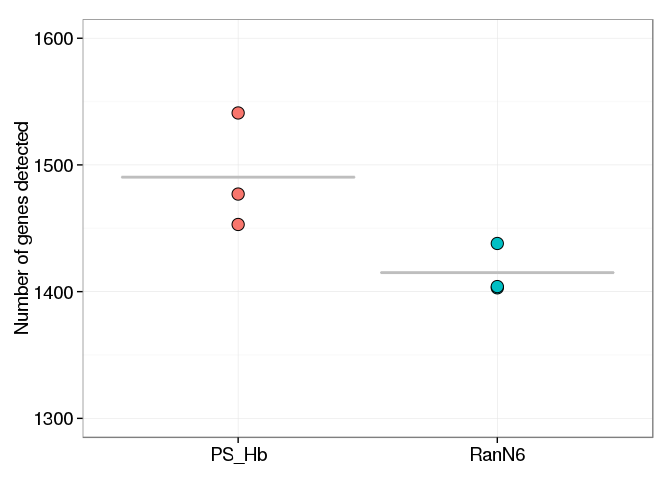

Targeted reduction of Hemoglobin cDNAs
======================================

Configuration
-------------


Cluster and annotate in the shell (not in R)
--------------------------------------------


```bash
LIBRARY=NC22b
BAMFILES=../Moirai/NC22b.CAGEscan_short-reads.20150625152335/properly_paired_rmdup/*bam

level1.py -o $LIBRARY.l1.gz -f 66 -F 516 $BAMFILES
level2.py -t 0 -o $LIBRARY.l2.gz $LIBRARY.l1.gz

function osc2bed {
  zcat $1 |
    grep -v \# |
    sed 1d |
    awk '{OFS="\t"}{print $2, $3, $4, "l1", "1000", $5}'
}

function bed2annot {
  bedtools intersect -a $1 -b ../annotation/annot.bed -s -loj |
    awk '{OFS="\t"}{print $1":"$2"-"$3$6,$10}' | 
    bedtools groupby -g 1 -c 2 -o collapse
}

function bed2symbols {
  bedtools intersect -a $1 -b ../annotation/gencode.v14.annotation.genes.bed -s -loj |
    awk '{OFS="\t"}{print $1":"$2"-"$3$6,$10}' | 
    bedtools groupby -g 1 -c 2 -o distinct
}

osc2bed $LIBRARY.l2.gz | tee $LIBRARY.l2.bed | bed2annot - > $LIBRARY.l2.annot
bed2symbols $LIBRARY.l2.bed > $LIBRARY.l2.genes
```

```
## Opening NC22b.l1.gz
```

Analysis with R
---------------

### Configuration


```r
library(oscR)        #  See https://github.com/charles-plessy/oscR for oscR.
library(smallCAGEqc) # See https://github.com/charles-plessy/smallCAGEqc for smallCAGEqc.
library(vegan)
```

```
## Loading required package: permute
## Loading required package: lattice
## This is vegan 2.0-10
```

```r
library(ggplot2)
library(pvclust)

stopifnot(
    packageVersion("oscR") >= "0.1.1"
  , packageVersion("smallCAGEqc") > "0.10.0"
)

LIBRARY <- "NC22b"
```

### Load data


```r
l1 <- read.osc(paste(LIBRARY,'l1','gz',sep='.'), drop.coord=T, drop.norm=T)
l2 <- read.osc(paste(LIBRARY,'l2','gz',sep='.'), drop.coord=T, drop.norm=T)

colnames(l1) <- sub('raw.NC22b.','',colnames(l1))
colnames(l2) <- sub('raw.NC22b.','',colnames(l2))

colSums(l2)
```

```
##  22_PSHb_A  22_PSHb_B  22_PSHb_C 22_RanN6_A 22_RanN6_B 22_RanN6_C 
##       3786       3196       6805      17433      18864      17218
```

```r
PSHb <- c('22_PSHb_A', '22_PSHb_B', '22_PSHb_C')
RanN6    <- c('22_RanN6_A', '22_RanN6_B', '22_RanN6_C')
```

### Normalization number of read per sample : libs2.sub

Libraries contain only very few reads tags. The smallest one has 3,191 counts.
In order to make meaningful comparisons, all of them are subsapled to 3190 counts.


```r
set.seed(1)
l2.sub <- t(rrarefy(t(l2),3190))
colSums(l2.sub)
```

```
##  22_PSHb_A  22_PSHb_B  22_PSHb_C 22_RanN6_A 22_RanN6_B 22_RanN6_C 
##       3190       3190       3190       3190       3190       3190
```

### Moirai statistics

Load the QC data produced by the Moirai workflow with which the libraries were
processed.  Sort in the same way as the `l1` and `l2` tables, to allow for easy
addition of columns. 


```r
libs <- loadMoiraiStats(multiplex = "NC22b.multiplex.txt", summary = "../Moirai/NC22b.CAGEscan_short-reads.20150625152335/text/summary.txt", pipeline = "CAGEscan_short-reads")
libs <- libs[colnames(l1),]
```

### Number of clusters

Count the number of unique L2 clusters per libraries after subsampling, and add
this to the QC table.  Each subsampling will give a different result, but the
mean result can be calculated by using the `rarefy` function at the same scale
as the subsampling.


```r
libs["l2.sub"]     <- colSums(l2.sub > 0)
libs["l2.sub.exp"] <- rarefy(t(l2), min(colSums(l2)))
```

### Richness

Richness should also be calculated on the whole data.


```r
libs["r100.l2"] <- rarefy(t(l2),100)
t.test(data=libs, r100.l2 ~ group)
```

```
## 
## 	Welch Two Sample t-test
## 
## data:  r100.l2 by group
## t = 13.061, df = 3.836, p-value = 0.0002544
## alternative hypothesis: true difference in means is not equal to 0
## 95 percent confidence interval:
##   7.645323 11.863046
## sample estimates:
## mean in group PS_Hb mean in group RanN6 
##            93.44089            83.68671
```


```r
boxplot(data=libs, r100.l2 ~ group, ylim=c(80,100), las=1)
```

 

### Hierarchical annotation

Differences of sampling will not bias distort the distribution of reads between
annotations, so the non-subsampled library is used here.


```r
annot.l2 <- read.table(paste(LIBRARY,'l2','annot',sep='.'), head=F, col.names=c('id', 'feature'), row.names=1)
annot.l2 <- hierarchAnnot(annot.l2)

libs <- cbind(libs, t(rowsum(l2,  annot.l2[,'class']))) 
```

### Gene symbols used normalisation data


```r
genesymbols <- read.table(paste(LIBRARY,'l2','genes',sep='.'), col.names=c("cluster","symbol"), stringsAsFactors=FALSE)
rownames(genesymbols) <- genesymbols$cluster

countSymbols <- function(X) length(unique(genesymbols[X > 0,'symbol']))

libs[colnames(l2.sub),"genes.sub"] <- apply(l2.sub, 2, countSymbols)
libs[colnames(l2),        "genes"] <- apply(l2,     2, countSymbols)
```


```r
dotsize <- mean(libs$genes.sub) /150
par(mar=c(7,10,2,30))
p <- ggplot(libs, aes(x=group, y=genes.sub)) +
stat_summary(fun.y=mean, fun.ymin=mean, fun.ymax=mean, 
geom="crossbar", color="gray") +
       geom_dotplot(aes(fill=group), binaxis='y', binwidth=1, 
dotsize=dotsize, stackdir='center') +
       	theme_bw() +
	theme(axis.text.x = element_text(size=14)) +
	theme(axis.text.y = element_text(size=14)) +
	theme(axis.title.x = element_blank())+
	theme(axis.title.y = element_text(size=14))+
  ylim(1300,1600) +
	ylab("Number of genes detected")
p + theme(legend.position="none")
```

 

#### statistical analysis of gene count (with normalized data)


```r
t.test(data=libs, genes.sub ~ group)
```

```
## 
## 	Welch Two Sample t-test
## 
## data:  genes.sub by group
## t = 2.6274, df = 2.7402, p-value = 0.08627
## alternative hypothesis: true difference in means is not equal to 0
## 95 percent confidence interval:
##  -21.01126 171.67793
## sample estimates:
## mean in group PS_Hb mean in group RanN6 
##            1490.333            1415.000
```


### Analysis of the gene expressed in different sample with different primers - normalized data (l2.sub)


```r
l2_to_g2 <- function(l2) {
  g2 <- rowsum(l2, genesymbols$symbol)
  as.data.frame(subset(g2, rowSums(g2) > 0))
}

g2.sub <- l2_to_g2(l2.sub)
g2     <- l2_to_g2(l2)  
G2 <- TPM(g2)

libs$genes.r <- rarefy(t(g2), 3190)[rownames(libs)]

t.test(data=libs, genes.r ~ group)
```

```
## 
## 	Welch Two Sample t-test
## 
## data:  genes.r by group
## t = 2.8877, df = 3.5177, p-value = 0.05212
## alternative hypothesis: true difference in means is not equal to 0
## 95 percent confidence interval:
##   -1.227913 157.191500
## sample estimates:
## mean in group PS_Hb mean in group RanN6 
##            1491.744            1413.763
```


```r
G2mean <- function(TABLE)
  TPM(data.frame( RanN6    = rowSums(TABLE[,RanN6])
                , PS_Hb    = rowSums(TABLE[,PSHb] )))

G2.sub.mean <- G2mean(g2.sub)
G2.mean     <- G2mean(g2)
```


```r
head(G2.sub.mean[order(G2.sub.mean$RanN6, decreasing=TRUE),], 30)
```

```
##                            RanN6       PS_Hb
## .                     110553.814 105956.1129
## J01415.3,J01415.4      91745.037  20271.6823
## HBB                    46917.450    731.4525
## J01415.2,J01415.24     36677.116   7941.4838
## HBA2                   20167.189   1253.9185
## MALAT1                 20062.696  42842.2153
## HBA1                   14629.049      0.0000
## RN7SL2                 11076.280   6060.6061
## Metazoa_SRP            10240.334   1462.9049
## Metazoa_SRP,RN7SL1      7941.484   1462.9049
## B2M                     7628.004   4597.7011
## MT-ND6                  4388.715   8150.4702
## BNIP3L                  3970.742   9926.8548
## ACTB                    3657.262    522.4660
## DHFR                    3343.783    940.4389
## FTL                     2716.823   1880.8777
## UBB                     2716.823   2298.8506
## MT-CO1                  2194.357   2298.8506
## MTRNR2L8                1880.878      0.0000
## RN7SK                   1880.878   1985.3710
## RNY4                    1880.878    208.9864
## RNY1                    1776.385    417.9728
## OAZ1                    1671.891    731.4525
## RMRP                    1671.891      0.0000
## RP5-857K21.4            1671.891   1044.9321
## RPS6                    1671.891   2612.3302
## FBXO7                   1567.398    522.4660
## HIST1H2BC               1567.398    626.9592
## RP11-1035H13.3,RPS15A   1567.398    104.4932
## RPLP1                   1567.398   1149.4253
```


```r
head(G2.sub.mean[order(G2.sub.mean$PS_Hb, decreasing=TRUE),], 30)
```

```
##                          RanN6      PS_Hb
## .                  110553.8140 105956.113
## MALAT1              20062.6959  42842.215
## J01415.3,J01415.4   91745.0366  20271.682
## BNIP3L               3970.7419   9926.855
## BCL2L1               1149.4253   9717.868
## HEMGN                1253.9185   8986.416
## HNRNPK                522.4660   8150.470
## MT-ND6               4388.7147   8150.470
## J01415.2,J01415.24  36677.1160   7941.484
## RN7SL2              11076.2800   6060.606
## COX7C                 104.4932   4806.688
## B2M                  7628.0042   4597.701
## RPL5                  313.4796   4075.235
## TPM3                  731.4525   3970.742
## RNU2-2,WDR74          835.9457   3866.249
## PKM                   208.9864   3761.755
## LCP2                  313.4796   3448.276
## C9orf78              1462.9049   3343.783
## NCOA4,TIMM23B         731.4525   3239.289
## SAT1                 1567.3981   3239.289
## SNHG12,SNORD99       1253.9185   3239.289
## SON                   835.9457   3239.289
## GYPC                  940.4389   3134.796
## PTMA                  522.4660   3134.796
## HMGB1                1358.4117   3030.303
## UQCRB                 104.4932   2821.317
## J01415.21            1253.9185   2716.823
## RPLP0                 835.9457   2716.823
## RPS6                 1671.8913   2612.330
## CAP1                  104.4932   2507.837
```

### Gene list on normalized data (table l2.sub)

```r
RanN6_genelist.sub <- listSymbols(rownames(subset(G2.sub.mean, RanN6>0)))
PSHb_genelist.sub <- listSymbols(rownames(subset(G2.sub.mean, PS_Hb>0)))
```


```r
genelist <- listSymbols(rownames(g2))
```


```r
write.table(genelist, 'NC22.genelist.txt', sep = "\t", quote = FALSE, row.names = FALSE, col.names = FALSE)
```


### Haemoglobin barplot


```r
par(mar=c(2,2,2,2))
barplot(t(G2[grep('^HB[AB]', rownames(g2), value=T),]), beside=T, ylab='Normalised expression value (cpm).', col=c("gray50","gray50", "gray50", "gray90", "gray90", "gray90"))
legend("topleft", legend=c("RanN6", "PS_Hb"), fill=c("gray90", "gray50"))
```

 
