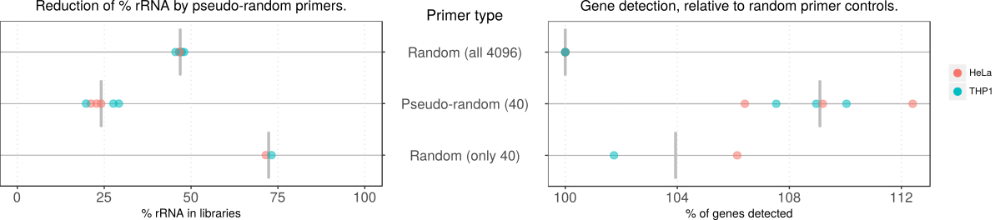

## Targeted reduction of highly abundant transcripts with pseudo-random primers

Figure: Pseudo-random primers can be used to reduce the amount of reads
matching rRNA in transcriptome libraries (left panel), without impairing gene
detection (right panel).  Replicate experiments performed on total RNA
extracted from HeLa or THP-1 cell cultures.  The reverse transcription primers
types were: _Random (all 4096)_: the standard mixture of 4096 different
hexamers; _Pseudo-random (40)_: 40 pseudo-random selected for their distance
with rRNA sequences; and _Random (only 40)_: 40 hexamers selected completely
randomly.

This repository contains supplemental files related to our manuscript
[published in BioTechniques](https://www.future-science.com/doi/10.2144/000114400):

_Targeted reduction of highly abundant transcripts using pseudo-random primers._
Ophélie Arnaud, Sachi Kato, Stéphane Poulain and Charles Plessy.
Biotechniques. 2016 Apr 1;60(4):169-74. doi:10.2144/000114400. [PMID:27071605](https://pubmed.gov/27071605).

The repository only contains light files.  In particular FASTQ and BAM files
are available for download at <http://genome.gsc.riken.jp/plessy-20160322/plessy-20160322.tar.gz>,
or from Zenodo [[FASTQ]](http://dx.doi.org/10.5281/zenodo.48112)
[[BAM]](http://dx.doi.org/10.5281/zenodo.48114).

The branch "[BioTechniques-2016](https://github.com/Population-Transcriptomics/pseudo-random-primers/tree/BioTechniques-2016)"
contains the supplemental data in its state at
the time of publication, but in the master branch, the files have evolved for
better formatting, or following questions from readers, or following the
needs to produce new figures for presentations.

### Scripts and programs used in the data analysis:

#### Selection of the pseudo-random primers.

This was supplemental file 1 in the manuscript [[Notebook]](design/design.md) [[R source]](design/design.Rmd).

#### Analysis of the first experiment, NCms10058.

This includes contents from supplemental files 2 and 3. [[Notebook]](NCki_clean/commandes_clean.md) [[R source]](NCki_clean/commandes_clean.Rmd)

#### Analysis of the second experiment, NC12.

This includes contents from supplemental files 2 and 4. [[Notebook]](Nc12_clean/commandes_clean.md) [[R source]](Nc12_clean/commandes_clean.Rmd)

#### Analysis of the third experiment, NC17.

This includes contents from supplemental files 2 and 5. [[Notebook]](NC17_clean/commandes_clean.md) [[R source]](NC17_clean/commandes_clean.Rmd)

#### Common analysis of the three experiments.

This includes contents from supplemental files 2 and 6.  [[Notebook]](3_exp/command.md) [[R source]](3_exp/command.Rmd)

#### Statistical analysis.

This was supplemental file 7.  [[HTML]](3_exp/stat/stats.html) [[R source]](3_exp/stat/stats.Rmd)

#### Analysis of the fourth experiment regarding the RNA extracted from blood, NC22.

This was supplemental file 8.  [[Notebook]](NC22b_clean/commands_NC22.md) [[R source]](NC22b_clean/commands_NC22.Rmd)
